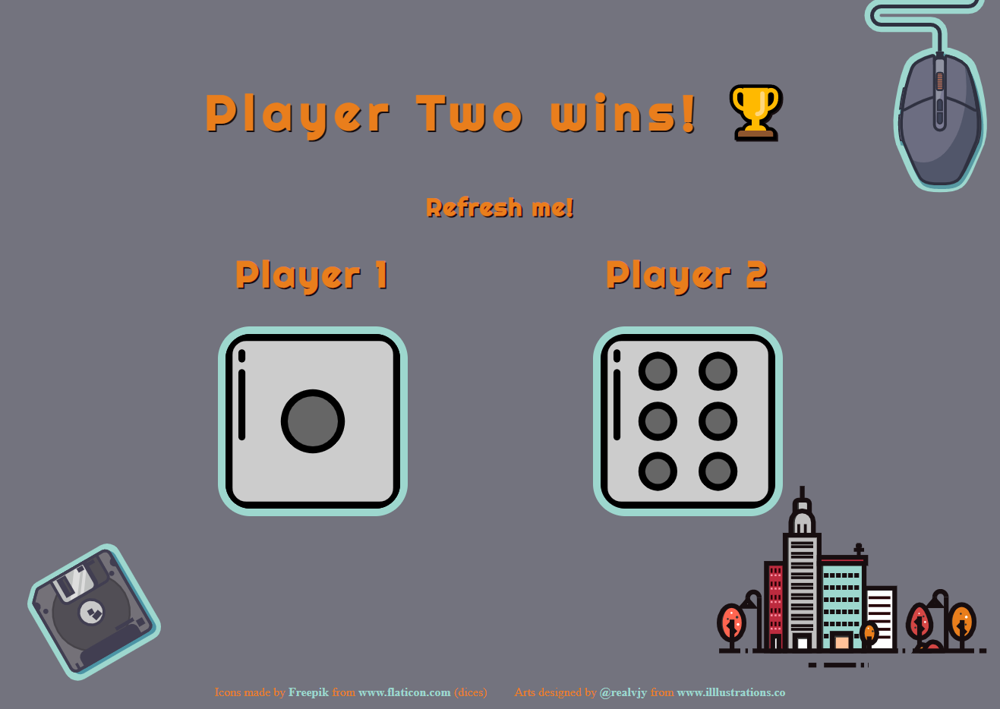

# DiceGame - dice roll generator

## Table of contents

* [General info](#general-info)
* [Screenshots](#screenshots)
* [Inspiration](#inspiration)

## _General info_

DiceGame is a single page application simulating a random dice roll for two players. Each time the page is refreshed, an animation "imitating" the rolling of the dices, and after 2 seconds, the final result shows the information which player won or whether there was a draw ¯ \ _ (ツ) _ / ¯ . I used HTML5, CSS3 and pure JavaScript.

## _Screenshots_

## _Inspiration_

 Project inspired by [Angela Yu](https://www.appbrewery.co)
